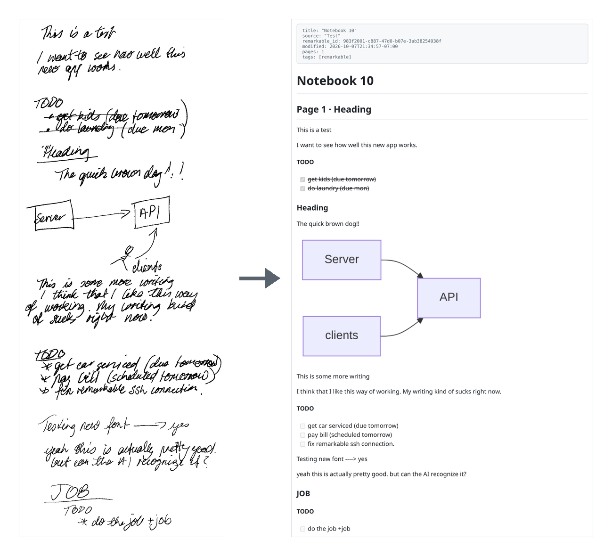

# rm2md

Write on your reMarkable. rm2md turns the pages into Markdown notes and, if you like, the to-dos
into [Taskwarrior](https://taskwarrior.org) tasks.

Sponsored by:

- **[Margin](https://marginpaper.com)**: hyperlinked PDF planners, journals and templates for
  reMarkable and other e-ink tablets.
- **[taskwarriorsync](https://taskwarriorsync.com)**: hosted sync for Taskwarrior 3, with your tasks
  encrypted on your machine before upload.



*Left: a page from the tablet. Right: the note rm2md wrote, shown as GitHub renders it, with the
sketch turned into a diagram ([raw Markdown](docs/images/after.md)).*

rm2md syncs one folder of notebooks from the tablet over SSH (Wi-Fi or USB). A vision model reads
the handwriting through [OpenRouter](https://openrouter.ai), and each notebook becomes one Markdown
file. The same page also gave these tasks:

```
Status     Description                     Due     Scheduled  Tags
pending    fix remarkable SSH connection                      remarkable
pending    do the job                                         job remarkable
pending    get car serviced                Oct 8              remarkable
pending    pay bill                                Oct 8      remarkable
completed  get kids                        Oct 8              remarkable
completed  do laundry                      Oct 12             remarkable
```

"(due tomorrow)" became a due date, "(scheduled tomorrow)" a scheduled date and `+job` a tag. The
two crossed-out lines were added as already completed. Cross out or tick a task later and the next
sync completes it in Taskwarrior.

## Features

- **Handwriting to Markdown.** Headings, lists and paragraphs, with a picture of each page under
  its text so you can always check the original.
- **To-dos to Taskwarrior (optional).** Due and scheduled dates, tags, projects and priorities written
  on the line. Each task is annotated with the notebook and page it came from. Turn it off with
  `tasks = false` and rm2md only writes notes.
- **Diagrams to Mermaid.** Flowcharts and box-and-arrow sketches become
  [Mermaid](https://mermaid.js.org) diagrams, which GitHub and Obsidian draw. Other drawings get a
  one-line description.
- **Cheap.** About $0.002 a page with the default model. Only pages that changed are sent, and
  typed (keyboard) text is read straight from the file at no cost.
- **Safe with your tasks.** rm2md only adds tasks and completes them. It never edits or deletes
  one, and a task you delete in Taskwarrior is not created again.

## Writing on the tablet

A line is a **task** when it starts with a hand-drawn box □, or with `TODO`, `todo:` or `[ ]`, or
sits in a list under a `TODO` or `Tasks` heading. Other bullet points stay notes.

On a task line you can write:

| write                                    | becomes                        |
|------------------------------------------|--------------------------------|
| a tick, cross or fill in the box, or a strike-through | completed         |
| `due fri`, `by 10/15`, `→ mon`           | due date (dates are month/day) |
| `scheduled tomorrow`, `start mon`        | scheduled date                 |
| `#word` or `+word`                       | tag                            |
| `@word` or `pro:word`                    | project                        |
| `!` or `(A)` · `(B)` · `(C)`             | priority H · M · L             |

These markers are taken out of the task text: "pay bill (due fri)" becomes the task "pay bill"
due Friday. A task counts as done only when its own line is crossed out or its own box ticked.
`*`, `•` and `-` bullets are never boxes.

For a **diagram**, draw boxes, diamonds or circles with words in them and connect them with arrows.
Words on an arrow become its label. rm2md keeps the direction you drew (top-down or left-to-right).
Words inside shapes never become tasks.

The tablet saves a page when you close its notebook. Close it, or go back to the library, before
a sync.

## Setup

You need:

- a reMarkable with SSH access. Tested on a reMarkable 2. The Paper Pro should work but hasn't
  been tried.
- Python 3.12+ and [uv](https://docs.astral.sh/uv/)
- Taskwarrior 3, only if you want tasks
- an [OpenRouter](https://openrouter.ai) API key
- optional: [mermaid-cli](https://github.com/mermaid-js/mermaid-cli) (`mmdc`), to check diagrams
  with Mermaid itself

1. **Find the tablet's address and password.** Both are under *Settings → Help → Copyrights and
   licenses*.
2. **Turn on SSH over Wi-Fi.** It is off by default and after every firmware update. Connect the
   tablet by USB and run:
   ```sh
   ssh root@10.11.99.1 rm-ssh-over-wlan on
   ```
3. **Install your SSH key.** Run `ssh-copy-id root@<tablet-ip>`. rm2md never types a password, so
   the key needs no passphrase, or must be loaded in ssh-agent.
4. **Install and configure rm2md:**
   ```sh
   uv tool install git+https://github.com/unixmonks/rm2md
   mkdir -p ~/.config/rm2md && (umask 077; cat > ~/.config/rm2md/openrouter_key)   # paste the key, then Ctrl-D
   rm2md init --host root@<tablet-ip> --folder "Notes"   # writes the config and tests it (--no-tasks for notes only)
   rm2md folders                                          # lists the folders, if unsure of the name
   rm2md sync -n                                          # preview: reads the pages, writes nothing
   rm2md sync
   ```
   The key can also come from `$OPENROUTER_API_KEY`.

Give the tablet a fixed address in your router (a DHCP reservation), so `host` stays right.

## Notes only

To use rm2md without Taskwarrior, set `tasks = false` in the config, or start with
`rm2md init --no-tasks`. Task lines still appear in the notes as checkboxes; nothing is sent to
Taskwarrior, and it need not be installed. `rm2md sync --no-tasks` does the same for one run.

If `tasks` is on but Taskwarrior is not installed, rm2md writes the notes and says once that it
skipped the tasks. To turn tasks on later, set `tasks = true` and run `rm2md sync --full` once:
it adds the tasks from notes already synced, without sending any page to the model again.

## Syncing automatically

Every hour with cron (`crontab -e`):

```
20 * * * * $HOME/.local/bin/rm2md sync -q >> $HOME/.local/state/rm2md/cron.log 2>&1
```

Or keep `rm2md watch` running, which syncs every five minutes. Both stay quiet while the tablet
is asleep or away, and catch up when it is back.

## Commands

```
rm2md init [--host H] [--folder F] [--notes-dir D] [--no-tasks] [--force]
                                write the config and test it
rm2md check                    test the connection and the folder
rm2md folders                  list the tablet's folders, with notebook counts
rm2md sync                     sync once
       -n, --dry-run            show what would change, write nothing
       --notebook NAME          only this notebook
       --retranscribe           read every page again (after changing the model)
       --no-tasks               notes only
       -q, --quiet              print only changes and errors
rm2md watch [--interval S]     sync every S seconds (default 300)
rm2md status                   notebooks, pages and tasks synced so far
```

`sync` exits 0 when all went well, 1 when a page could not be read (it is retried next time) or
the folder is wrong, and 2 when the tablet cannot be reached.

## Configuration

`~/.config/rm2md/config.toml`, written by `rm2md init`:

| setting       | default                    | what it does                                        |
|---------------|----------------------------|-----------------------------------------------------|
| `host`        | `root@10.11.99.1`          | the tablet over SSH                                 |
| `ssh_options` | `[]`                       | extra ssh options, e.g. `["-i", "~/.ssh/id_rm"]`    |
| `folder`      | `Inbox`                    | the tablet folder to sync: a name or a path         |
| `recursive`   | `true`                     | include subfolders                                  |
| `notes_dir`   | `~/notes/remarkable`       | where the Markdown goes                             |
| `page_images` | `true`                     | save a picture of each page under its text          |
| `model`       | `google/gemini-3.8-flash`  | any OpenRouter vision model                         |
| `reasoning`   | `low`                      | model effort: `low` is about $0.002 and 4 s a page  |
| `tasks`       | `true`                     | create Taskwarrior tasks; `false` for notes only    |
| `task_tags`   | `["remarkable"]`           | tags added to every task                            |
| `task_project`| `""`                       | project for tasks that don't name one               |
| `task_sync`   | `false`                    | run `task sync` after adding or completing tasks    |

## Where things go

```
~/notes/remarkable/
├── Meeting notes.md                  one Markdown file per notebook
├── Work/Standup.md                   subfolders on the tablet become subfolders here
└── assets/Meeting notes/<page>.png   the page pictures
```

Each note is rewritten on every sync, so edit on the tablet, not in the file. Renaming or moving a
notebook on the tablet moves its note. A notebook taken out of the folder keeps its note. PDFs and
EPUBs are skipped.

rm2md keeps its records in `~/.local/state/rm2md/` and a copy of the synced notebooks in
`~/.cache/rm2md/`.

## Troubleshooting

- **"cannot reach the tablet"**: the tablet is asleep, or its address changed. Wake it and check
  the address under *Settings → Help → Copyrights and licenses*.
- **Connection refused, though the tablet answers ping**: SSH over Wi-Fi is off, usually after a
  firmware update. Run `rm-ssh-over-wlan on` over USB again (step 2 of Setup).
- **"Host key verification failed"**: firmware updates give the tablet new SSH host keys. Remove
  the old one with `ssh-keygen -R <tablet-ip>`, then connect once with `ssh root@<tablet-ip>`.
- **New tasks don't show in `task list`**: a Taskwarrior context may be hiding them. Try
  `task rc.context=none +remarkable list`.

## Development

```sh
uv run pytest                            # unit tests, plus full syncs against a fake tablet folder and the real `task`
tests/fake_tablet_ssh.sh                 # sync over real SSH from a busybox/dropbear container (needs Docker)
RM2MD_LIVE=1 tests/fake_tablet_ssh.sh   # the same with the live model, on generated handwriting
uv run python docs/make_images.py        # rebuild the pictures above from a demo page
```
