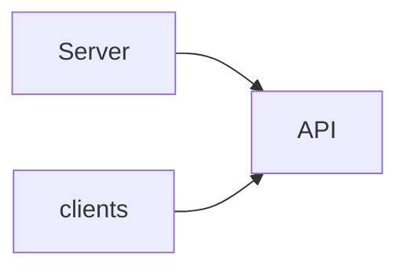

<!-- Written by rm2md from the reMarkable notebook. Edits here are overwritten on the next sync. -->

# Notebook 10

## Page 1 · Heading

This is a test

I want to see how well this new app works.

#### TODO
- [x] ~~get kids (due tomorrow)~~
- [x] ~~do laundry (due mon)~~

### Heading

The quick brown dog!!

This is some more writing
I think that I like this way of working. My writing kind of sucks right now.

#### TODO
- [ ] get car serviced (due tomorrow)
- [ ] pay bill (scheduled tomorrow)
- [ ] fix remarkable ssh connection.

Testing new font ----> yes

yeah this is actually pretty good. but can the AI recognize it?

### JOB

#### TODO
- [ ] do the job +job

